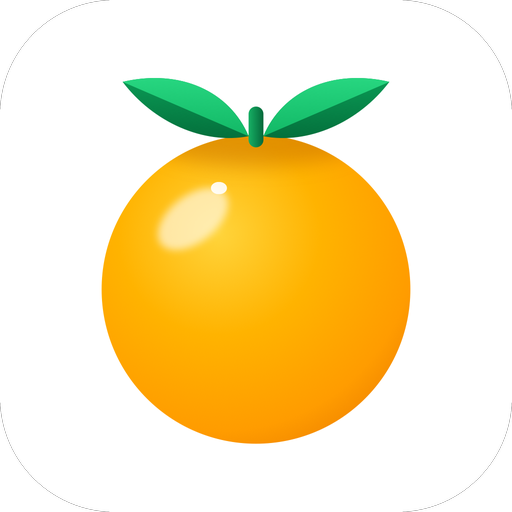

<p align="center">
  
</p>

<h1 align="center">Melogold для Linux</h1>

<p align="center">Клиент <a href="https://github.com/melogold-app/melogoldAndroid">Melogold</a> для Linux: музыка из YouTube Music с общими избранным, библиотекой и плейлистами на всех устройствах.</p>

## Статус

В разработке, срезы 0.1 — [docs/PROMPT.md §7](./docs/PROMPT.md). Готово:

- каркас: окно GTK 4 и libadwaita, разделы Тренды · Новое · Библиотека и Настройки, узкое окно от 360 px;
- один экземпляр, ссылки `melogold://`, `.desktop` и иконки;
- настройки с ключами Android, журналы, «Диагностика», окно сочетаний клавиш.

Дальше — воспроизведение, каталог, библиотека, аккаунт и синхронизация, тексты, выпуск: AppImage с
самообновлением из [GitHub Releases](https://github.com/melogold-app/melogoldLinux/releases), пакеты deb и rpm, Flatpak.

## Сборка

Нужны Rust 1.85+, GTK 4.20+, libadwaita 1.8+ и GStreamer.

```bash
# Fedora
sudo dnf install -y rust cargo gtk4-devel libadwaita-devel gstreamer1-devel gstreamer1-plugins-base-devel
cargo build --release
./target/release/melogold

cargo test --workspace            # тесты ядра без экрана
./scripts/install-local.sh        # в ~/.local: ссылки melogold:// из браузера и значок в меню
./scripts/snapshots.sh            # снимки окна во вложенном weston, в target/snapshots
```

Где что лежит: база, журналы и кэш музыки — `~/.local/share/melogold`, обложки — `~/.cache/melogold`,
настройки — `~/.config/melogold/settings.json`.

Строки интерфейса и иконка приложения берутся из Windows-клиента:
`./scripts/sync-strings.py` и `./scripts/sync-icon.py` (рядом должен лежать `melogoldWindows`).

Как устроен клиент и как его писать — [docs/PROMPT.md](./docs/PROMPT.md); задания — [tasks/](./tasks/).

## Лицензия

[GPL-3.0](./LICENSE).

## Остальные части Melogold

| Платформа | Репозиторий |
|---|---|
| Android | [melogoldAndroid](https://github.com/melogold-app/melogoldAndroid) |
| Сервер | [melogoldServer](https://github.com/melogold-app/melogoldServer) |
| Windows | [melogoldWindows](https://github.com/melogold-app/melogoldWindows) |
| Linux | [melogoldLinux](https://github.com/melogold-app/melogoldLinux) |
| iOS и macOS | [melogoldiOSmacOS](https://github.com/melogold-app/melogoldiOSmacOS) |
