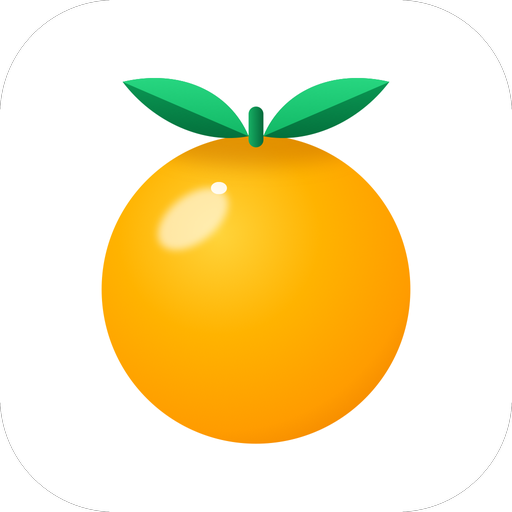

<p align="center">
  
</p>

<h1 align="center">Melogold для Linux</h1>

<p align="center">Клиент <a href="https://github.com/melogold-app/melogoldAndroid">Melogold</a> для Linux: музыка из YouTube Music с общими избранным, библиотекой и плейлистами на всех устройствах.</p>

## Статус

В разработке, срезы 0.1 — [docs/PROMPT.md §7](./docs/PROMPT.md). Готово:

- каркас: окно GTK 4 и libadwaita, разделы Тренды · Новое · Библиотека и Настройки, узкое окно от 360 px;
- один экземпляр, ссылки `melogold://`, `.desktop` и иконки;
- настройки с ключами Android, журналы, «Диагностика», окно сочетаний клавиш;
- воспроизведение без yt-dlp: поиск YouTube Music и YouTube с подсказками, поток и кэш музыки, панель
  плеера, «Сейчас играет», очередь с похожими, MPRIS (медиаклавиши, плеер GNOME Shell и KDE);
  от нажатия до звука — медиана 1,6 с;
- каталог: «Тренды» и «Настроения», «Новое», альбом, исполнитель и канал YouTube, плейлист с догрузкой,
  ссылки YouTube (вставкой в поиск, перетаскиванием и из командной строки);
- библиотека: Избранное, свои плейлисты, История, «Все треки», сохранённые альбомы и исполнители; загрузки и
  «Скачанное» с блоком «В кэше»; «Сохранить файлом» (.m4a без перекодирования); меню трека, «Отменить» у
  удалений; выделение нескольких треков и действия с ними; свои название, исполнитель и альбом трека;
- аккаунт на сервере Melogold: вход, регистрация с кодом восстановления, устройства, вход новых устройств по коду;
  токены — в связке ключей; синхронизация Избранного, плейлистов, сохранённого, своих названий и истории со всеми
  устройствами за секунды, История по устройствам;
- тексты песен: синхронный текст с подложкой текущей строки на пружине, дуэт, подпевка, время слов, проигрыши;
  YouTube Music, LrcLib и KuGou; «Найти другой текст», импорт LRC/TTML, редактор с синхронизацией по нажатию;
  свои и выбранные тексты и закреплённые тексты — на всех устройствах;
- отделка: таймер сна, скорость и нормализация громкости, столбики «играет» под настоящий звук, кадры видео без
  чёрных полей, «Сейчас играет» во весь экран (F11), все сочетания клавиш в их окне;
- Настройки целиком: библиотека и история, хранилище с пределами кэшей, «Сохранить копию» и «Импорт копии»
  (ViTune, ViMusic, Melogold любой платформы), обновления из GitHub Releases, «Лицензии».

Дальше — Flatpak для Ubuntu 24.04, Debian 13 и Mint 22.

## Установка

Последний выпуск — [GitHub Releases](https://github.com/melogold-app/melogoldLinux/releases/latest):

| Система | Файл |
|---|---|
| Любая с glibc 2.42+ (Fedora 43+, Ubuntu 25.10+, Arch, openSUSE Tumbleweed) | `Melogold-x86_64.AppImage` — обновляется сам |
| Fedora 43+ | `melogold-*.rpm`: `sudo dnf install ./melogold-*.rpm` |
| Ubuntu 25.10+, Debian testing | `melogold_*_amd64.deb`: `sudo apt install ./melogold_*_amd64.deb` |

AppImage при первом запуске сам добавляет себя в меню и открывает ссылки `melogold://`.

## Сборка

Нужны Rust 1.85+, GTK 4.20+, libadwaita 1.8+ и GStreamer.

```bash
# Fedora
sudo dnf install -y rust cargo gtk4-devel libadwaita-devel gstreamer1-devel gstreamer1-plugins-base-devel
cargo build --release
./target/release/melogold

cargo test --workspace            # тесты ядра без экрана
./scripts/install-local.sh        # в ~/.local: ссылки melogold:// из браузера и значок в меню
./scripts/snapshots.sh            # снимки окна во вложенном weston, в target/snapshots
./scripts/package.sh              # AppImage, deb, rpm и update.json в dist/ (контейнер Fedora 43, podman)
./scripts/release.sh --publish    # проверки, пакеты и выпуск vX.Y.Z на GitHub
```

Где что лежит: база, журналы и кэш музыки — `~/.local/share/melogold`, обложки — `~/.cache/melogold`,
настройки — `~/.config/melogold/settings.json`.

Строки интерфейса и иконка приложения берутся из Windows-клиента:
`./scripts/sync-strings.py` и `./scripts/sync-icon.py` (рядом должен лежать `melogoldWindows`).

Как устроен клиент и как его писать — [docs/PROMPT.md](./docs/PROMPT.md); задания — [tasks/](./tasks/).

## Лицензия

[GPL-3.0](./LICENSE).

## Остальные части Melogold

| Платформа | Репозиторий |
|---|---|
| Android | [melogoldAndroid](https://github.com/melogold-app/melogoldAndroid) |
| Сервер | [melogoldServer](https://github.com/melogold-app/melogoldServer) |
| Windows | [melogoldWindows](https://github.com/melogold-app/melogoldWindows) |
| Linux | [melogoldLinux](https://github.com/melogold-app/melogoldLinux) |
| iOS и macOS | [melogoldiOSmacOS](https://github.com/melogold-app/melogoldiOSmacOS) |
